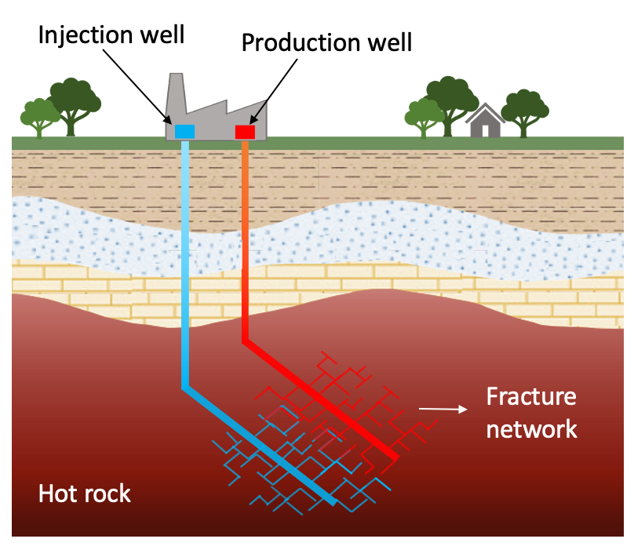

# Geothermal Energy Production and Operation 

## Geothermal Energy Production and System Types (@Nicolas)

Geothermal energy is a renewable energy resource that, in principle, is available “anywhere" in the world. This happens due to the universal increase in temperature with depth that occurs within Earth’s subsurface. This unique feature of geothermal energy distinguishes it from other forms of renewable energy such as wind, solar, biofuels, and hydropower, which derive their energy from sources above the Earth's surface. Hence, the underground exploration and extraction of geothermal energy poses unique challenges, including technical complexities, economic risks, and uncertainties in resource estimation that are inherent to geothermal resources and are not typically encountered in other renewable energy sectors. As a result, geothermal energy production requires specialized knowledge, equipment, and considerable financial investment which has restricted its development. To accelerate the widespread deployment of geothermal energy, numerous technical designs have been proposed over the past century to optimize the use of deep geothermal systems. These technologies vary in terms of their complexity, technological maturity, and commercial success. The following are the geothermal system types that are currently being used and/or investigated for commercial development:

- Conventional hydrothermal systems

Conventional geothermal systems are characterized by the natural occurrence of specific geological conditions at depth. For instance, a conventional hydrothermal reservoir necessitates the confluence of multiple factors, including a high-temperature aquifer situated at shallow depths (i.e., less than 4 kilometers), adequate amount of pore space filled with water or brine, and sufficiently high in situ permeability {cite}`Tester2012`. Consequently, these reservoirs are geographically constrained and typically found in regions with considerable volcanic or magmatic activity. Although hydrothermal resources offer substantial energy potential, their rarity has resulted in that high-potential resources have already been identified and developed, thereby making it increasingly challenging to discover new sites.

Furthermore, given the complex geological processes that underlie the formation hydrothermal reservoirs, a comprehensive understanding of the geological evolution of subsurface conditions is critical for identifying prospective locations. The factors influencing hydrothermal reservoir formation, such as the presence of a magmatic heat source, the availability of water or brine, and the permeability and porosity of the subsurface rocks, need to be thoroughly analyzed through various geophysical and geochemical techniques. 

Thus, while existing conventional hydrothermal systems continue to produce significant amount of renewable energy and, although scarce, potential new sites offer significant opportunities, the growing demand for renewable energy and the depletion of conventional resources necessitate the exploration of alternative geothermal systems. 

- Enhanced geothermal systems

Enhanced Geothermal Systems (EGS) refer to artificial reservoirs created by drilling wells into naturally impermeable rock formations, and then increasing their permeability through hydraulic stimulation techniques such as hydraulic fracturing and/or shearing (Figure 2). By stimulating the reservoir, the goal is to emulate the high productivity characteristics of hydrothermal systems. The concept of EGS was first proposed in the early 1970s by researchers at the Los Alamos National Laboratory in the United States {cite}Armstead1987. Since then, the technical feasibility of EGS has been demonstrated at several research sites worldwide TEST1: {cite}Breede2013 {cite}GTO2014. (TEST2: {cite}Breede2013, GTO2014) TEST3: {cite}Breede2013;GTO2014. However, no commercially viable EGS site currently exists that can produce heat or electricity at a competitive Levelized Cost of Energy (LCOE).

The development and deployment of EGS technology face significant challenges, including technical and environmental concerns such as clogging of the fracture network and induced seismicity (Breede et al., 2013; Olasolo, 2016; Lu, 2018; Kumari & Ranjith, 2019; Ge & Saar, 2022). These issues have impacted the cost-competitiveness of EGS which has limited the successful roll-out and operation of EGS projects. Despite these challenges, the potential benefits of EGS, such as increased energy security and reduced greenhouse gas emissions, have attracted considerable interest from researchers, policymakers, and industry stakeholders. Ongoing research efforts are aimed at improving the reservoir performance and cost-effectiveness of EGS systems, with the ultimate goal of achieving widespread commercial deployment.

- Advanced Geothermal Systems

Advanced Geothermal Systems (AGS) have emerged as a promising technology for extracting geothermal energy using a closed-loop system that is emplaced within the subsurface. Unlike Enhanced Geothermal Systems (EGS), where the working fluid 
interacts directly with the rock, AGS relies on the circulation of a working fluid through a closed wellbore that is isolated from the surrounding formation. The specific geological properties of the reservoir are therefore less important in AGS since the working fluid does not come into direct contact with the rock. Instead, AGS systems harvest heat from the rock through heat conduction (Figure 3). Interestingly, the concept of deep closed-loop geothermal systems was first proposed almost a century ago (Hodgson, 1927), but no commercial-scale system exists as of today. Since no AGS field data are available yet, it is still unclear if such an underground heat exchanger can sustain reasonable thermal output over the course of multiple decades at an affordable cost (Beckers et al., 2022; Malek et al., 2022).

However, recent years have seen a surge of interest and investment in AGS technology from both industry and academic sectors. This has been spurred mainly by the advent of a handful of closed-loop geothermal startups in the United States, which have reignited the discussion on the potential of closed-loop systems to considerably increase geothermal energy production at a commercial scale while mitigating the concerns associated with EGS and conventional hydrothermal systems (CHS) operations. These concerns include induced seismicity, groundwater contamination, and fluid-rock chemical interactions, among others (Beckers et al., 2022).

Despite the lack of commercial-scale AGS systems, ongoing research efforts aim to improve the understanding of AGS technology and address the technical and economic challenges that currently limit its deployment. Some of the research areas include improving the design and operation of closed-loop systems, optimizing drilling technologies, developing novel materials and technologies for subsurface heat exchangers, and assessing the environmental and social impacts of AGS projects (Higgins et al., 2019; Scherer et al., 2020). With continued research and development that would drive the cost of these systems down, AGS has the potential to become a key contributor to the global transition toward a low-carbon energy future.

<b>By the way:</b> One of our researchers is working on this topic. Some short description following after  

- CO2-based geothermal systems

Geothermal energy extraction processes have traditionally relied on water as the subsurface working fluid, as described in the geothermal system types described above (Hodgson, 1927; Bodvarsson, 1974; Arsmtead & Tester, 1987). However, recent theoretical and numerical studies conducted over the last two decades have demonstrated the potential of supercritical CO2 (sCO2) as a substitute for water, owing to its distinct chemical-, transport- and thermodynamic properties (e.g., Brown, 2000; Pruess, 2006; Randolph & Saar, 2011a, 2011b; Zhang et al., 2014). Consequently, for each of the three reservoir types previously discussed, a conceptual analog that utilizes sCO2 as the subsurface working fluid has been proposed. In the literature, these systems are commonly referred to as CO2-Plume Geothermal (CPG) system, CO2-Enhanced Geothermal System (CO2-EGS), and CO2-Advanced Geothermal System (CO2-AGS), respectively. The use of sCO2 in geothermal energy extraction has several advantages over water, including its superior transport properties, which result in higher energy production rates from geothermal reservoirs, and the fact that it does not react chemically with the subsurface rocks or induce mineral scaling, which can reduce the lifespan of the well (Jenkins et al., 2020). However, there are also some technical and environmental challenges associated with sCO2-based geothermal systems, including the need for specialized materials and equipment, the need for a CO2 source close to the geothermal reservoir, the risk of CO2 leakage through the subsurface, among others (Jenkins et al., 2020; Kessler et al., 2021). Research in this field is ongoing, with the aim of developing and optimizing sCO2-based geothermal systems for commercial use in the near future.

<b>By the way:</b> One of our researchers is investigating the chemical performance of CPG systems and how this influences their techno-echonomic viability. Find out more <a href="https://geg.ethz.ch/nicolas-rangel-jurado/">here</a>!

Given the challenges and opportunities associated with geothermal energy, ongoing research and development efforts aim to optimize its use and overcome the limitations mentioned above. These efforts involve advancements in drilling technology, resource assessment, and innovative engineering designs that can improve the efficiency and cost-effectiveness of geothermal energy systems. In conclusion, the prospect of deploying geothermal energy globally presents a promising opportunity to meet energy demands in a sustainable and environmentally friendly manner, and ongoing research and development efforts are vital for realizing its full potential.

## Reservoir simulation (@Ryan)

Reservoir simulation is a calculation that is performed on a computer by solving a set of Partial Differential Equations (PDEs) utilizing a certain computer program, such as Python, C, etc., for mimicking and understanding the behavior of a reservoir system. These PDEs describe physical and chemical processes within the reservoir system, related to mass transport, heat transport, momentum transport, and reactive transport (Kolditz et al., 2012). Here, we recognize four fundamental processes that might happen within the reservoir system: 

  - Thermal process (T): it describes propagation of thermal energy by conduction, convection, and advection 
  - Hydraulic process (H): it describes fluid movement in the porous and/or fractured systems, following Darcy’s law
  - Mechanical process (M): it describes solid deformation due to changes in pore pressure, thermal stress, and tectonic influences
  - Chemical process (C): it describes chemical reaction between fluid and solid surface under certain pressure and temperature

In nature, these fundamental processes always occur at the same time, leading to coupled/multi-physics simulation condition, e.g. thermo-hydro (TH) simulations, etc. The main ingredients to conduct reservoir simulation are 1) meshed geological model, 2) measurement data, and 3) PDE solver, contained in softwares such as TOUGH2, CMG, etc.   

The main interest in many reservoir simulation is to know the production capacity of a reservoir system. Therefore, introducing producers and/or injectors is of interest to evaluate the amount of heat that can be produced. The most commonly considered  injection-production patterns for geothermal reservoir development are doublet and five-spot pattern (Grant and Bixley, 2011).

 - Doublet pattern

Doublet pattern is a configuration consisting of a producer and an injector separated over a certain distance. It is the most commonly used pattern for geothermal energy extraction. Within the simulation, the setup is to inject cold water through injector and produce heated cold-water through producer. Here, we are interested in monitoring the advancement of cold water front. A fast arrival of cold water front at producer will cause cooling at the producer, hence, reduce the thermal output of the system.

 - Five-spot pattern

Five-spot pattern is a configuration consisting of a producer with four injectors separated over a certain distance where the injectors encircle the producer. Here, the injection-production setup for the simulation is the same as in doublet pattern. The interest is to monitor the cold water front to avoid its fast arrival at producer. 

Since the amount of measurement data is often limited, it is critical to account uncertainties within our simulations. It is to estimate risk in any operations. The uncertainty quantification is always performed with probabilistic framework which demands numerous model runs. It is computationally expensive. An option to reduce this computational load is to use machine learning to accelerate the model run.

Machine learning provides a low-dimensional representation from parameters to any quantity of interest. However, we need to carefully use and deploy this machine learning technique by including physics during its training. It is to improve its intepretability and reliability.

<b>By the way:</b> One of our researchers is working on physics-based machine learning technique that includes physical laws into the machine learning construction to improve machine learning interpretability and reliability. Find out more <a href="https://easygo-itn.eu/ryan-santoso/">here</a> or <a href="https://scholar.google.co.id/citations?user=abGVFp8AAAAJ&hl=de&oi=ao">here</a>!

# The Heat Loss Effect in Geothermal Steam Production Well

Courtesy of [https://indiaenergyportal.org/geothermal-energy/]

In geothermal power generation, the efficient extraction of steam from underground reservoirs is crucial for maximizing energy production. Geothermal steam is primarily obtained through production wells drilled into high-temperature reservoirs. However, during the extraction process, a significant amount of heat is lost from the steam due to various mechanisms. Understanding and minimizing this heat loss effect is essential for optimizing the overall efficiency of geothermal power plants.

(section-label-1)=
## Heat Loss Mechanisms:

Understanding the heat loss mechanisms is crucial for optimizing geothermal energy extraction and minimizing energy losses. The primary heat loss mechanisms in geothermal steam production wells include conduction, convection, radiation, and heat exchange with the surrounding formation. 

### Conduction: 

Conduction is the transfer of heat through a solid medium. In the context of geothermal wells, heat loss through conduction occurs primarily through the well casing and the surrounding rock formations. The casing material, typically made of steel, has a finite thermal conductivity. As the hot geothermal steam flows through the wellbore, heat is conducted through the casing walls, resulting in heat loss to the environment. Similarly, heat can be conducted from the steam into the cooler surrounding formations, leading to a decrease in steam temperature.

### Convection: 

Convection is the transfer of heat through the movement of fluids. In geothermal steam production wells, convection heat loss occurs when the rising steam comes into contact with cooler fluids or rock formations along the wellbore. This contact causes heat transfer from the steam to the surrounding medium, resulting in a reduction in steam temperature. Convection can also occur within the well itself, as fluid circulation patterns can lead to the mixing of hot and cooler fluids, further contributing to heat loss.

### Radiation: 

Radiation is the transfer of heat through electromagnetic waves. In the case of geothermal steam production wells, radiation heat loss occurs as the steam interacts with the wellbore and the surrounding environment. The steam emits infrared radiation, which can escape through the wellbore and be absorbed by the surrounding formations or the atmosphere. This process leads to a loss of thermal energy from the steam, reducing its temperature.

These heat loss mechanisms have a significant impact on the overall efficiency and productivity of geothermal steam production wells. The loss of heat from the steam results in a decrease in steam temperature, which affects the efficiency of power generation. Lower-temperature steam requires additional energy input for conversion into electricity, resulting in reduced power output and decreased overall plant efficiency.[Tester, J. W., et al. (2006).](section-lable-1)

## How to mitigate the heat loss effect in geothermal steam production wells?

Mitigating the heat loss effect in geothermal steam production wells is crucial for optimizing energy efficiency and maximizing the power generation capacity. Here are several strategies and techniques that can be employed to minimize heat loss.

### Strategies can be applied as following: 

#### *Insulation*: 

Applying insulation materials around the well casing can help reduce heat loss through conduction. Insulating materials with low thermal conductivity, such as fiberglass or ceramic fiber, can be installed to minimize heat transfer from the steam to the surrounding wellbore. Additionally, insulating the surface pipelines that transport the steam can prevent heat loss during transportation.

#### *Wellbore Integrity*: 

Ensuring the integrity of the wellbore is essential for minimizing heat loss. Proper cementing techniques and wellbore construction can help create a barrier between the steam and the surrounding formations, reducing heat transfer through conduction and convection.

#### *Downhole Heat Exchangers*: 

Implementing downhole heat exchangers can recover some of the lost heat. These devices allow for the transfer of heat from the geothermal steam to a working fluid, which can be utilized for power generation or other applications. By capturing and utilizing the heat that would otherwise be lost, the overall efficiency of the geothermal system is improved.

#### *Advanced Well Design*: 

Optimized well designs, such as double-casing systems or thermal liners, can minimize heat loss by reducing the contact between the steam and cooler surroundings. These designs create a thermal barrier that improves the retention of thermal energy in the steam and reduces heat transfer.

#### *Steam Separator and Re-injection*: 

Installing steam separators at the wellhead can help separate any non-condensable gases from the steam. These gases have a lower heat content and can be re-injected back into the reservoir, reducing the loss of valuable thermal energy.

#### *Surface Heat Recovery*: 

Implementing heat recovery systems at the surface can capture waste heat from the geothermal steam. This recovered heat can be utilized for various purposes, such as space heating, industrial processes, or district heating, further improving the overall energy efficiency of the geothermal system.

#### *Monitoring and Optimization*: 

Regular monitoring and optimization of the geothermal system can help identify and address any heat loss issues promptly. This includes monitoring well performance, steam quality, and temperature profiles to ensure efficient steam production and identify areas for improvement.

In conclusion, the heat loss effect in geothermal steam production wells poses a significant challenge to efficient power generation. It is a critical factor that influences the efficiency and productivity of geothermal power plants. Understanding the mechanisms and implementing effective mitigation strategies can help maximize energy extraction, improve power generation efficiency, and extend the lifespan of geothermal reservoirs. It is worth noting that the specific mitigation strategies employed may vary depending on the geological characteristics of the geothermal resource, the well design, and the available technologies. Therefore, it is important to consider site-specific factors and consult with geothermal experts and engineers to implement the most suitable mitigation measures for a particular geothermal steam production well.

# Well Performance in Geothermal Systems
## Well Inflow Performance

Well Inflow Performance is a critical concept in geothermal systems that helps evaluate the performance of production wells and understand the relationship between the fluid flow rate and the pressure drawdown in the reservoir. The scientist Darcy was the first studied extensively the relationship between pressure and flow rate. The IPR provides insights into the productivity of the reservoir, enabling engineers to optimize the production and maximize energy extraction.

Courtesy of [https://production-technology.org/well-inflow-performance/]

As a function of production rate, the well's flowing bottom-hole pressure (Pwf) is referred to as the inflow performance relationship (IPR). It describes the reservoir's flow. In the pressure range between the average reservoir pressure and atmospheric pressure, the Pwf is defined. The graph that follows shows a typical link between inflow performance and inflow. 

Courtesy of [https://production-technology.org/well-inflow-performance/]

The flow rate corresponding to a Pwf of zero is found at the point where the PI plot and x-axis connect. The Absolute Open Flow (AOF) potential of the well is represented by this location on the IPR plot.

## Vertical Lift Performance Relationship (VLP)

The bottom-hole pressure is described as a function of flow rate by the Vertical Lift Performance Relationship (VLP), also known as Outflow. Numerous variables, such as the fluid PVT characteristics, well depth, tubing size, surface pressure, water cut, and GOR, affect the VLP. It describes the flow from the wellhead to the well's bottom hole.

Courtesy of [https://production-technology.org/well-inflow-performance/]

The wellbore flowing pressure is related to the surface production rate by both the Inflow Performance Relationship and the Vertical Lift Performance Relationship. While the IPR reflects what the reservoir can supply to the bottom hole, the VLP represents what the well can send to the surface. 

Courtesy of [https://production-technology.org/well-inflow-performance/]

The well deliverability, which expresses what a well will actually produce for a specific operating condition (Pr, PI, WC, GOR, THP, tubing size...), is produced by the intersection of the IPR and the VLP, also known as the operational point. 

