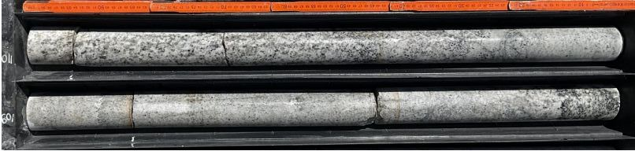

# Exploration of Geothermal Resources

Geothermal exploration is the process of searching for and identifying areas of the Earth's crust that have the potential to host geothermal energy resources. It involves a comprehensive assessment of the geological and geophysical properties of the target area, including rock and fluid properties, temperature and pressure gradients, and the location and extent of heat sources.

## Where do we explore?
Geophysical exploration is the process of studying the subsurface of the Earth to locate areas that are likely to have high levels of geothermal energy. Geothermal energy production is possible in areas where the Earth's crust is relatively thin, allowing heat from the Earth's interior to be easily accessed. Some areas that are ideal for geothermal energy production include:
`
`````{admonition} Ideal areas for geothermal energy production
:class: tip
* Volcanic regions: Regions with active or dormant volcanoes are often good sites for geothermal energy production, as they have high levels of heat flow and permeable rock layers.

* Rift zones: Areas where the Earth's crust is being pulled apart, such as along the Mid-Atlantic Ridge or the East African Rift, can provide access to hot rocks and geothermal reservoirs.

* Hot springs and geysers: These natural features indicate the presence of geothermal reservoirs close to the Earth's surface, which can be used for geothermal energy production.

* Subduction zones: These are areas where tectonic plates are colliding, and one plate is being forced beneath another. This process can cause magma to rise to the surface and create hotspots for geothermal energy production.
`````
We use geologic evidence from the surface and analyze rock samples to understand the formation of these different zones. Once geophysicists have sufficient information about the geology, they proceed to use geophysical instruments to explore the specific location. 

## How do we explore?

In geothermal exploration, our targets are usually located kilometres underground. Thus, direct exploration, as drilling exploratory wells, comes with a high cost and only give good information in the vicinity of the borehole. This makes techniques that can image the underground from the surface highly attractive.

When trying to understand geophysical imaging techniques, it helps to visualise a szenario, that is closer to our everyday life: When using ultrasound to image an organ in the body, an ultrasound source is placed on the body and emits a small soundwave. When this wave encounters denser parts of the body, an echo will be reflected. From the strength and the time between sending and receiving the echo, we can subsequently create an image of the organ. The same technique is used in seismic exploration, where sound waves are emitted into the geothermal reservoirs, again building an image from the echos.

When imaging the underground for geothermal exploration, we can only deploy our sources and measurement devices on the surface. Thus we are usually very far (1-5km) from the geothermal reservoir, that we want to image. This is why we often look for key features like big faults in the reservoir, that are still visible by our geophysical equipment. Imaging these faults allows us to locate fruitful targets to drill into to further investigate the geothermal potential. Geophysicists employ a variety of techniques, to get the best picture of the underground:

`
`````{admonition} Techniques often used for geothermal exploration
:class: note
 * Seismics: Using waves in form of ground motion, captures information of the subsurfaces where it passes throught. Using seismometers to record the movement at certain station thus gives us insight about the underground.

 * Gravity: Rocks of different densities alter the gravitational field of the earth very slightly. Measuring the gravitational field at the surface of the earth allow us to detect areas with dense or less dense material.

 * Electromagnetics: Simliar to Seismics, electromagnetic methods use electromagnetic waves travelling in the subsurface. These can be generated by human made sources, but also stem from the solar wind interatting with the earths magnetic field and lightnings.
`````

### Seismic
<!-- PICTURES: Vibrotruck? / Geophones /  GIF with wavefield data
- Explain the method and make a gif with wave propagation  -->

One of the most important methods of imaging the earth are seismic waves. Seismic waves are waves of ground motion, that travel through the earth. Just like in ultrasound, these waves get reflected and refracted at obstacles and boundaries and carry lots of information about the underground structure. The field, that studies seismic waves, is called seismology and has traditionally investigated earthquakes, to understand the science behind earthquakes, learn about the structure of the earth and subsequently protect humankind from natural disasters.

In exploration geophysics, we use the very same phenomena, to image a small, chosen part of the underground, to understand its structure. Since we cannot have earthquakes as a source of seismic waves at the spot, where we want to examine a geothermal site, we must generate seismic waves ourselves. For this, geophysicists use a variety of sources. For shallow experiments, a hammer with a metal plate is enough to generate a wave, that travels tens of meters. If you need the waves to travel deeper into the earth more energy is needed. Therefore, we either use explosives of vibration trucks to create stronger waves. To record the seismic waves, one uses so called geophones instead of seismometers. These consist of a metal pin, that gets firmly inserted into the ground. Attached to the metal pin is an accelerometer, that picks up the ground movement. For a seismic survey, a handful of geophones is laid out on the surface about the reservoir, that we want to image. After installing all the geophones, the sources get placed at different positions at the geothermal site, and at each site, an experiment is conducted. After all experiments at the source locations have been conducted, all the recorded data is collected and passed to a geophysicist for analysis. By analysing all the reflections picked up at the geophones, a detailed image of the underground can be produced.

<!--  -->
```{figure} ../GeothermalEnergy/exploration_pictures/IMG_20220906_120542.jpg
---
height: 600px
name: IMG_20220906_120542.jpg
---
A vibrotruck acquiring data in a seismic survey.
```

<div class="alert alert-block alert-info">
<b>By the way:</b> One of our researchers is working on this topic. <b>Hagen Söding</b> is is using high resolution seismic techniques to find and monitor CO<sub>2</sub>, that has been stored in the underground. <a href="https://easygo-itn.eu/hagen-soding/">Learn more about his work</a>.
</div>

### Multi-physics
 
Apart from seismic methods which are considered more "active" methods, there are other more passive methods that look at different properties of the Earth. They are also useful for other application that need an image of the subsurface. 

#### Gravity method:
Gravity is the force by which a planet or other body draws objects towards its center. In geophysics, gravity is used to study the distribution of mass in the Earth's subsurface. A gravity survey involves measuring the gravitational pull of the Earth at various locations on the surface. This changes due to the density or mass of the bodies that are within the Earth. Geophysicist use a device called a gravimeter to make these measurements. By measuring tiny changes in gravitational force, scientists can create maps that show areas where the Earth's subsurface contains more or less mass. This can help identify features associated to geothermal systems. 
#### Electromagnetic methods:
Electromagnetic (EM) waves are waves of energy that travel through space and can be used to study the Earth's subsurface. In geophysics, EM methods involve sending EM waves into the ground and measuring their response. EM surveys can be conducted using different frequencies and techniques. When EM waves encounter different types of rocks and minerals in the subsurface, they can induce electrical currents to flow. By measuring these currents, we can create maps that show variations in the subsurface electrical properties. This can help identify areas with different rock types, especially areas that are conductive such as areas of high heat flow. A common method done under this realm of geophysical techniques is the magnetollueric method or MT. This method is used to study the electrical conductivity structure at a much deeper scale. It involves measuring the natural variations in the Earth's magnetic field and electric field at the Earth's surface, and using these measurements as the source. By analyzing the frequency-dependent variations in these fields, we can estimate the electrical resistivity of different rock layers and fluids in the subsurface which is of great importance in geothermal exploration. 


```{figure} ./exploration_pictures/EM_survey_Pijnacker.gif
---
height: 300px
name: EM_survey_Pijnacker.gif
---
Acquiring data in a EM survey.
```
```{figure} ./exploration_pictures/gravityacquisition.jpg
---
height: 300px
name: gravityacquisition.jpg
---
Aquiring gravity data in the field.
```


<div class="alert alert-block alert-info">
<b>By the way:</b> One of our researchers is working on this topic. <b>Mahmoud Eltayieb</b> is is using controlled-source electromagnetic methods to track cold fronts in geothermal reservoirs. <a href="https://easygo-itn.eu/mahmoud-eltayieb/">Learn more about his work</a>.
 </div>
 <!-- - Explain the method and make a gif with wave propagation  -->
 
### Exploratory well drilling
<!-- - Image of core logs (Bedretto core logs)
- Paragraph of different type of well data  -->

<!-- maybe reorder to connect to andreas pargraph above? -->

Exploratory wells are drilled to explore the subsurface geology and determine the presence and characteristics of geothermal reservoirs. They typically involve drilling deep into the earth's crust to access geothermal fluids like water or steam, that are heated by the earth's natural heat. The fluids are then pumped to the surface and analyzed for their temperature, pressure, chemistry, and other properties.

One of the main purposes of exploratory wells is to determine the size and potential of a geothermal resource. This information is critical for assessing the feasibility of a geothermal power plant and estimating its potential power output. Exploratory wells can also help to identify the characteristics of a geothermal reservoir, such as its permeability, porosity, and fracture network. Geothermal engineers use this information to determine optimal locations for production wells, which in turn ensures efficient and sustainable use of the geothermal resource.

An essential part of exploratory drilling is collecting well logs. For these logs specialized tools are lowered into the wellbore and record various physical properties of the rock formations in the borehole. Here are some of the most common types of well logs:

`
`````{admonition} Common types of well logs
:class: note

* Electrical Logs: measure the electrical properties of the rock formations encountered during drilling. 

* Acoustic Logs: measure the time it takes for sound waves to travel through the rock formations, as well as the amplitude and frequency of the waves. 

* Nuclear Logs: use radioactive sources to emit gamma rays or neutrons into the rock formations, and measure the radiation that is emitted back. 

* Imaging Logs: use various techniques to create images of the wellbore and the surrounding rock formations. 

* Temperature Logs:measure the temperature and distribution within the borehole to learn about the heat flow.

* Other Logs: Other types of well logs include e.g. pressure logs and production logs.
`````

Overall, the use of multiple types of well logs can provide comprehensive data about the subsurface geology and rock properties and assists to identify potential geothermal reservoirs. For example, the presence of high porosity and permeability in certain rock formations within the borehole can indicate the presence of a geothermal reservoir, as these properties are important for the storage and movement of hot fluids.


[//]: # ()

<!--  -->

<!--  -->

{float: right; }

### Geochemistry for exploration
Another important role of exploratory wells is to assess the potential output of geothermal resources by providing access to subsurface geothermal fluids and rocks. The sampled geothermal fluids and rocks can then be studied via geochemical techniques.

Geochemistry is the study of the chemical and physical processes that occur in rocks, minerals, and fluids in the Earth's crust. To find geothermal resources, we use geochemistry to identify areas with high temperatures and to understand the nature of the fluids and rocks underground. Geochemical techniques, such as isotopic analysis, and mineralogical studies, help to assess the feasibility of developing a geothermal resource. Sometimes, gases like carbon dioxide, hydrogen sulfide, and methane are released from the Earth's subsurface, which can provide clues about the geothermal system below. By measuring the type and amount of gases, geoscientists can estimate the temperature and location of the geothermal reservoir. 

`````{admonition} Geochemistry in geothermal production
:class: tip
Geochemical analysis is also used to monitor geothermal production. Geochemist use techniques to determine the chemical composition of geothermal fluids including the presence of dissolved gases, minerals, and trace elements to evaluate the potential for mineral scaling and corrosion. This is important, since scaling and corrosion can impact the efficiency and longevity of geothermal power plant operations. For more information about the risks involved in these processes refer to [Issues and Safety of Geothermal Operations](https://easygo-itn.github.io/Deliverable_4_2/issues_and_safety.html)
`````

## From data to underground models - Geophysical Inversions
When investigating a geothermal site, we usually have a simple geological model of the subsurface in advance, but the real subsurface is often way more complex. Once we collected sufficient data in a geophysical survey, we try to find a realistic model, that explains our measured data. Given our simple geological model, we can verify our model guess by simulating our geophysical method and comparing the simulated to the measured data. Calculating simulated data from a model and comparing it to our recorded data is commonly referred to as forward modelling.

If we do not have a good match between the simulated data from our simple model and the recorded data, we update the model step by step, by including more details, until our model explains the recorded data. Therefore we would calculate, if increasing a model parameter leads improvment or worsening in the fit between our simulated and recorded data. If an slight increase leads to an improvement in the fit, we would then update the model accordingly and otherwise decrease the model value slightly. This stepwise procedure is called optimisation and the whole process of building a model from recorded data is referred to as inverse modelling.

```{figure} ./exploration_pictures/Inversion_loop.png
---
height: 600px
name: Inversion_loop.png
---
Forward modelling vs. inverse modelling.
```

<div class="alert alert-block alert-info">
<b>By the way:</b> One of our researchers is working on this topic. <b>Andrea Balza Morales</b> is integreating geophysics and geologic modeling by the means of inversion. <a href="https://easygo-itn.eu/andrea-e-balza-morales/">Learn more about her work</a>.
 </div>

## Modelling
 ### Geologic model
Geological modelling is a critical component of geothermal exploration. Geothermal resources are often located in complex geological settings, making it essential to create a detailed model of the subsurface geology to identify potential geothermal reservoirs. Once the geophysical inversion has been completed, we use this data to create a geological model of the subsurface. The geological model incorporates data from the geophysical inversion with other geological data such as drill cores, well logs, and surface mapping. Geologists also create models of the different structural features present in the subsurface, such as faults and fractures. These models help to understand the subsurface geology and identify areas where geothermal fluids may accumulate. A wide range of computer software is used to create a 3D model of the subsurface geology which incorporates the different data types, allowing geologists to visualize the subsurface geology in three dimensions. Below is an example of a 3D geologic model of the Utah Forge geothermal test site. 

 <!-- - Look for gempy model of Utah forge existing site (granite wih some sedimentary layers on top) -->
