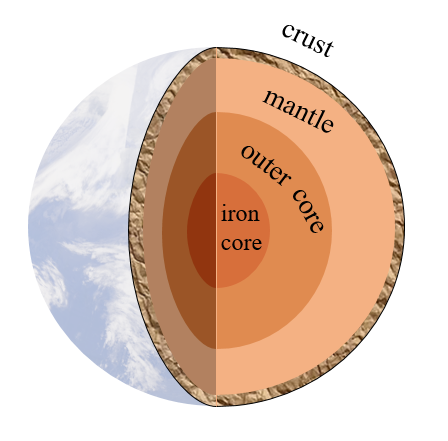
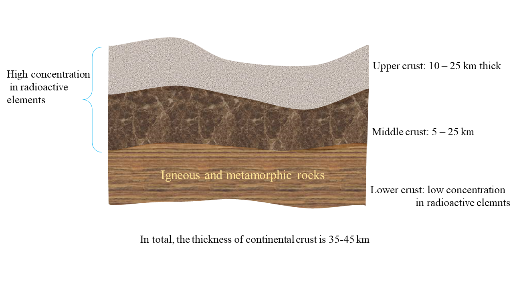

# The origins of geothermal energy

This chapter is about the origins/sources of geothermal energy
## What is geothermal energy (@ Wen)
Geothermal energy, viewed as a promising clean and renewable energy source, is the heat stored in the rocks and fluids in the Earh. Technically, geothermal energy refers the heat contained in the upper crust with accessible depth. The total heat contained in the Earth is in the order of 12.6 x 1024, while in the crust, the order of 5.4 x 1021 {cite}`WEC_Geothermal`.
## Where is the heat from ? (@ Wen)
The fact that there is heat stored in the Earth is typically evidenced by the intrusion of magma at volcanic sites and widespread distribution of hot springs. Actually, heat flux exists on the every squar meter of the Earth surface, which on average is 87 mW/m2, with a total (integrating over the whole surface) amount of ~ 4.4 x 1013 J/s {cite}`heatflux1, heatflux2`. The heat flux observed on the surface of the Earth is a result of conduction, convection and radiation from the inner part of the Earth. 

Now we know that heat flux exists across each square meter of the Earth's surface, and is attributed to various mechanisms such as conduction, convection, and radiation arising from its interior. The next question is, what is the origin of the heat? Before answering this question, it is worthwhile to introduce briefly the structure of our planet.

The Earth has four parts, the inner core, the outer core, the mantle and the crust, shown in Fig.1.
 * inner core: composed of solid iron at the temperature of around 5200 degree C,  with a radius of 1221 km;
 * outer core: composed of liquid iron and nickel at the temperature between 4500 ~ 5500 degree C, with a radius of 2200 km approimately.
 * mantle: composed of silicate minerals, oxides and other high-density minerals whose atoms are relatively small, e.g. magnesium (Mg), titanium (Ti), calcium (Ca) and aluminum (Al){cite}`heatflux1` at the temperature ranging from 1000 ~3700 degree C {cite}`geographic`, with a thickness of 2890 km approximately.
 * crust: consists of oceanic (thickness between 6 ~ 10 km) and continental (30 ~ 60 km) crusts. Oceanic crust is composed mostly of mafic rock like basalt troctolite and gabbro, while continental crust is composed mostly of granites {cite}`geographic`.

Knowing the Earth structure, it is time to answer the question, what is the origin of the heat stroed in the Earth.

The origin of this heat can be attributed to two sources: the residual heat from the early formation of the Earth's core and the heat generated from radioactive decay {cite}`heatflux1`. The prevailing consensus suggests that a proportion of the thermal energy harnessed through geothermal utilizations, approximately 40%, is derived from the residual heat associated with the early formation of the Earth's core, whereas the remaining 60% is sourced from the heat produced by the decay of long-lived isotopes {cite}`heatflux1`.

### Remaning heat from the early formation of the Earth (@ Wen)
Let's have a closer look on the heat arising from the early formation of the Earth's core. Approximately 4.56 billion years ago, the Earth underwent formation through the accumulation of matter from the nascent solar nebula. Dust particles, sand-sized objects, and other debris collided and  aggregated, ultimately giving rise to terrestrial-sized planets in a matter of several tens of millions of years {cite}`heatflux1`. When the planet was growing by accreting materials, the kinetic energy of incoming bodies that impacted the planetary surface was partly transformed to heat {cite}`heatflux1`. As the planet continued to expand in size, the pressures in the interior caused the compression of silicate minerals and other substances, thereby leading to a corresponding increase in the planet's internal temperature {cite}`heatflux1`. In addition, the decay of plentiful, short-lived radioactive elements that were present in the early solar nebula resulted in the heating of the adjacent environment through collisions between particles and the atoms surrounding the decaying isotopes {cite}`heatflux1`.

As a result of the above processes occuring in early life of our planet, the Earth's interior temperature rose, surpassing the melting point of iron. Then the liquid iron migrated to the center of the Earth due to higher density compared to silicates which was in contact with the iron, forming a liquid core. Heat was also produced during that migration process resulting from the release of gravitational potential energy {cite}`heatflux1`.

The amalgamation of these factors gave rise to a differentiated planet that featured a molten iron core, forming in a period of under 30 million years {cite}`core_formed`. Since then, the core has undergone gradual cooling, resulting in the establishment of a solid inner core  with a radius of 1221 km and a liquid outer core with a radius of 2200 km approimately.

### Heat from radioactive decay of long-lived isotopes (@ Wen)
Since the formation of the Earth, metal was redistributed, accompanied by density stratification. While the core is composed of iron, the mantle, which in contact with the outer core, mainly consists of silicate minerals, oxides and other high-density minerals whose atoms are relatively small, e.g. magnesium (Mg), titanium (Ti), calcium (Ca) and aluminum (Al){cite}`heatflux1`, resulting in low existence of radioactive elements. Directly formed from mantle (extruded magma), the oceanic crust  thus, the same with the mantle, havs a low abundance of radioactive elements {cite}`heatflux1`. In contrast, the continental crust, composed of minerals that was incompatible with the high-density minerals in the mantle, holds the largest global reservoir of radioactive elements, such as potassium (K), uranium (U) and thorium (Th). 

More specifically, considering the density profile of continental crust, three layers can be characterised: lower, middle and upper crust {cite}`heatflux1`, shown in Fig.2. The lower layer is mainly composed of igneous and metamorphic rock with low concentrations of radioactive elements, whereas the middle and upper crusts are more enriched in radioactive elements {cite}`heatflux1`. The heterogeneous distribution of radioactive elemtns and the largely varying thickness in the crust as a result of tectonic activity, which forms mountains and basins, result in substantial variation in heat flux on the surface {cite}`heatflux1`. Consequently, the geothermal gradient in the shallow crust can be quite unevenly.

