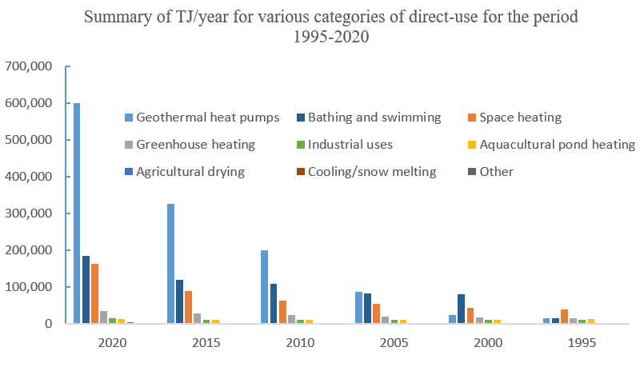

# Geothermal Energy Utilisation

## Introduction @Tristan
From the geothermal reservoir we can produce hot fluids carrying plenty of thermal energy. This thermal energy can be
used to heat homes, offices and even greenhouses, which is particularly attractive in cold climates, where heating 
represents a large portion of the total energy consumption.

Where there is no demand for heating, for example in hot climates or during the summer months in cold climates, or
where there is no consumer in the vicintiy of the geothermal reservoir, the thermal energy can also be converted to
other forms of energy such as electricity. This can be transported more easily over long distances to the consumers.

## Role of Geothermal Energy @Lorenzo

* depends where you are
* Iceland is driven by geothermal but in a unique position
* multipurpose tool - Munich area 

## Direct Use @Wen
The versatile direct utilisations of geothermal fluids with a temperature between 10 &deg;C - 150 &deg;C {cite}`anderson1979direct` has been ducomented for over 2000 years {cite}`direct-2000`. By the end of 2019, the total annual energy consumption from direct geothermal use is 283,580 GW h worldwide, reported in 88 countries and/or regions {cite}`lund2021direct`.The figure [data from {cite}`lund2021direct`] below shows main categories of direct utilisations of geothermal energy, dominated by heat pumps, bathing & swimming, and space heating. 

### Geothermal Heat Pumps

So far, geothermal heat pumps (GHPs), also called ground-source heat pumps, have been the most popular way to directly utilise geo-fluids since its first use in 1850s in Austria {cite}`heatflux1`.  GHPs take advantages of the fact that a few feet below Earth's surface, the temperatue of the ground remains relatively constant, ranging from 7 &deg;C - 25 &deg;C {cite}`DOE:2023`. In the winter, the ground is warmer than the air above it while, in the summer, colder. GHPs then acts like a refrigerator, transferring heat through geo-fluids for building heating, ventilation and air conditioning {cite}`heatflux1`.

### Space Heating
Space heating, including individual space heating and district heating, dates back from 14th century when inhabitants of French village, Chaudes-Aigues Cnatal, utilised geothermal heat via a district heating networks that is still in use today {cite}`stanford`. Wells or multiple wells, consisting of producer and injector, are used to circulate geo-fluids with a temperature ranging from 60 &deg;C - 90 &deg;C {cite}`spaceheating`. If high enough temperature can be reached at a depth of 20 m - 200 m,, downhole exchangers can also be used. The leading countries in space heating are China, Iceland and Turkey, with a worldwide installed capacity reaching 12768 MWt by the end of 2019 {cite}`lund2021direct`.

### Bathing & Swimming

### Greenhouse Heating

### Industrial Use

### Aquacultural Pond Heating

### Agricultural Drying

### Cooling/Snow Melting

### Other

## Energy Conversion @Tristan
Converting from one form of energy to another is always associated with losses. The most familiar type of such losses 
in our everyday life are frictional losses. For example an electric car converts electric potential energy into kinetic 
energy, but the friction between the wheels and the road surface eventually brings the vehicle to a stand still once 
the car's battery is empty. These kind of frictional losses are broadly described as mechanical losses.

Besides the aforementioned mechanical losses, conversion of thermal energy into more useful forms of energy like 
mechanical energy (in turn this can easily be converted into rotational and then electrical potential energy via use of
a turbine and generator). This is because the conversion is an irreversible process.

A process is reversible if it takes but a small nudge to reverse the process, however when it take a significant effort 
to reverse a process it is considered irreversible. Cooking is a great example of irreversible processes; it is simple 
enough to fry some fish, but is it significantly more difficult to unfry the fish and return it to its original state.

There are a number of processes for converting thermal energy to mechanical energy, these are often referred to as heat
engines or power cycles.

### Carnot Cycle

Definitions:
A thermal reservoir is a body at a constant temperature. No adding of thermal energy will change its temperature. For 
example, adding a pot of boiling water to a lake will not measurably change the lake's average temperature.

The Carnot Cycle converts the heat flow between two differently tempered thermal reservoirs into work (mechanical energy).
The Carnot Cycle is the simplest, most efficient, but merely theoretical heat engine.

1. The initial state
2. The boundary to the hot reservoir is opened to allow heat transfer. Then the system is slowly (reversibly) expanded,
with the heat transfer from the hot reservoir maintaining it at a constant temperature
3. The boundary to the hot reservoir is then closed isolating the cell. The fluid is then expanded until its temperature
drops to that of the cold reservoir
4. The boundary to the cold reservoir is opened to allow heat transfer. The fluid is then reversibly compressed,with
heat transfer into the cold reservoir maintaining the fluid's temperature constant
5. The boundary to the cold reservoir is then closed, isolating the cell. The fluid is then compressed until the 
temperature reaches that of the hot reservoir.
6. Repeat from 2.

Insert some diagrams

* something about net power and efficiency
* how one could realise the various stages of the cycle
  * isothermal heat addition with expansion - pure fluid phase change (from liquid to vapour)
  * isentropic expansion - use a turbine, but liquid might drop out....
  * isothermal heat removal with compression - pure fluid phase change (from vapour to liquid)
  * ientropic compression - pump or compressor, but they dont like vapour/liquid respectively

### Rankine Cylce
1. Compress a fluid to a higher pressure - e.g. using pump
2. Use a heat source to heat and evaporate the fluid
3. Use a turbine to expand the hot fluid to the starting pressure
4. Use a heat sink to cool and condense the fluid to the starting pressure
5. Repeat from 1.

Insert diagram(s)

## Power Plants

### Dry Steam @Tristan
* Geofluid arrives as vapour is the easiest to handle because we can directly use it to drive a turbine
* Link back to Rankine Cycle (reservoir is heat introduction)

### Flash @Tristan
* Geofluid is a mixture of liquid and vapour
* only vapour portion can be utilised as liquid is incompressible
* flash temperature optimisation

### Binary @Lorenzo

Historically speaking, the first geothermal resources that were exploited are those providing brine at high temperatures, perhaps even in vapor state, as it is the case of Larderello in Italy. On the contrary, extracting energy from brines at lower temperatures is more challenging and the classical dry steam or flash power plant might not be profitable. In this case, the usual approach to first use the geothermal brine to heat another more suitable fluid, and have this secondary fluid undergo a rankine cycle. The cooled down brine is subsequently reinjected into the ground. This is the concept of Binary Geothermal Power Plant. 

The standard rankine cycle for geothermal applications is called Organic Rankine Cycle (ORC): this is because the fluid flowing inside the machinery (pump, heat exchangers, turbine) is usually an hydrocarbon, whose properties are selected to maximize the efficiency of the power plant. In particular, the boiling point is much lower than that of compressed water, allowing the generation of the vapor that drives the turbine without any need of a flashing procedure. 

## Power Plant Equipment @Lorenzo
All the geothermal power plants convert the thermal energy into electricity by using several different machinery. In particular, the most recurring component is the turbine: its scope is to extract the energy of the vapor and convert it into mechanical energy.

A typical axial turbine for binary geothermal power plants is shown below: at its simplest, it is composed of a shaft driven by a series of wing-like elements, called blades. The blades are radially disposed around the shaft. By blowing the hot vapor on the blades, each one of them will generate some lift, and their combination will induce the rotation of the turbine.

The heat exchangers come in different models and are responsible for several different thermodynamic transformations. In the binary power plants, we can usually see two different types of heat exchangers: the shell and tube types and the fin and tube types.

The first ones can be used when there is no fluid in gaseous phase contributing to the heat exchange process: their typical application is in the evaporator of the binary power plant, which is responsible of transferring heat from the geothermal brine to the working fluid undergoing the rankine cycle. here, usually two different shell and tube heat exchangers are used: one to preheat the fluid and bring it on the verge of evaporation, and the other to generate the actual vapor that will eventually drive the turbine. Despite being of the same typology, they work in quite a different way.

### Heat Exchanger

### Pump

### Turbine

### Generator

### Valve/Orifice
