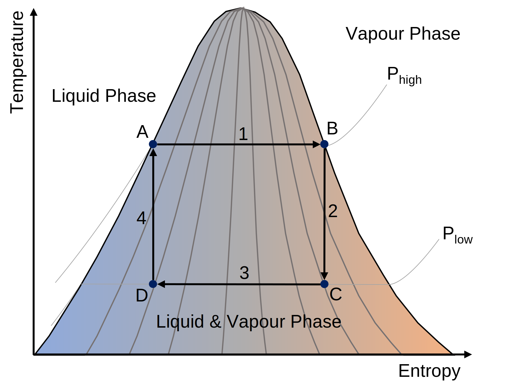
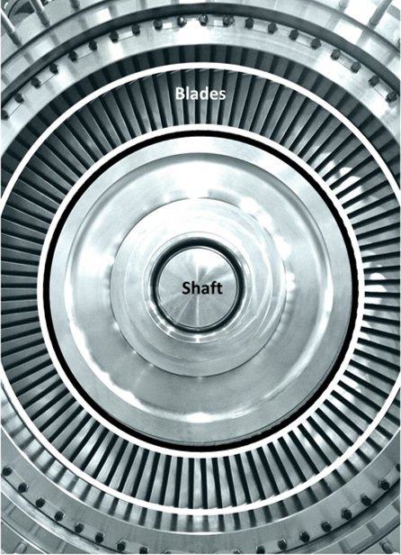

# Geothermal Energy Utilisation

## Introduction @Tristan
From the geothermal reservoir we can produce hot fluids carrying plenty of thermal energy. This thermal energy can be
used to heat homes, offices and even greenhouses, which is particularly attractive in cold climates, where heating 
represents a large portion of the total energy consumption.

Where there is no demand for heating, for example in hot climates or during the summer months in cold climates, or
where there is no consumer in the vicintiy of the geothermal reservoir, the thermal energy can also be converted to
other forms of energy such as electricity. This can be transported more easily over long distances to the consumers.

## Role of Geothermal Energy @Lorenzo

* depends where you are
* Iceland is driven by geothermal but in a unique position
* multipurpose tool - Munich area 

## Direct Use @Wen
The versatile direct utilisations of geothermal fluids with a temperature between 10 &deg;C - 150 &deg;C {cite}`anderson1979direct` has been ducomented for over 2000 years {cite}`direct-2000`. By the end of 2019, the total annual energy consumption from direct geothermal use is 283,580 GW h worldwide, reported in 88 countries and/or regions {cite}`lund2021direct`.The figure [data from {cite}`lund2021direct`] below shows main categories of direct utilisations of geothermal energy, dominated by heat pumps, bathing & swimming, and space heating. 

### Geothermal Heat Pumps

So far, geothermal heat pumps (GHPs), also called ground-source heat pumps, have been the most popular way to directly utilise geo-fluids since its first use in 1850s in Austria {cite}`heatflux1`.  GHPs take advantages of the fact that a few feet below Earth's surface, the temperatue of the ground remains relatively constant, ranging from 7 &deg;C - 25 &deg;C {cite}`DOE:2023`. In the winter, the ground is warmer than the air above it while, in the summer, colder. GHPs then acts like a refrigerator, transferring heat through geo-fluids for building heating, ventilation and air conditioning {cite}`heatflux1`.

### Space Heating
Space heating, including individual space heating and district heating, dates back from 14th century when inhabitants of French village, Chaudes-Aigues Cnatal, utilised geothermal heat via a district heating networks that is still in use today {cite}`stanford`. Wells or multiple wells, consisting of producer and injector, are used to circulate geo-fluids with a temperature ranging from 60 &deg;C - 90 &deg;C {cite}`spaceheating`. If high enough temperature can be reached at a depth of 20 m - 200 m,, downhole exchangers can also be used. The leading countries in space heating are China, Iceland and Turkey, with a worldwide installed capacity reaching 12768 MWt by the end of 2019 {cite}`lund2021direct`.

### Bathing & Swimming

### Greenhouse Heating

### Industrial Use

### Aquacultural Pond Heating

### Agricultural Drying

### Cooling/Snow Melting

### Other

## Energy Conversion @Tristan
Converting from one form of energy to another is always associated with losses. The most familiar type of such losses 
in our everyday life are frictional losses. For example an electric car converts electric potential energy into kinetic 
energy, but the friction between the wheels and the road surface eventually brings the vehicle to a stand still once 
the car's battery is empty. These kind of frictional losses are broadly described as mechanical losses.

Besides the aforementioned mechanical losses, conversion of thermal energy into more useful forms of energy like 
mechanical energy (in turn this can easily be converted into rotational and then electrical potential energy via use of
a turbine and generator). This is because the conversion is an irreversible process.

A process is reversible if it takes but a small nudge to reverse the process, however when it take a significant effort 
to reverse a process it is considered irreversible. Cooking is a great example of irreversible processes; it is simple 
enough to fry some fish, but is it significantly more difficult to unfry the fish and return it to its original state.

There are a number of processes for converting thermal energy to mechanical energy, these are often referred to as heat
engines or power cycles.

### Carnot Cycle

Definitions:
A thermal reservoir is a body at a constant temperature. No adding of thermal energy will change its temperature. For 
example, adding a pot of boiling water to a lake will not measurably change the lake's average temperature.

The Carnot Cycle converts the heat flow between two differently tempered thermal reservoirs into work (mechanical energy).
The Carnot Cycle is the simplest, most efficient, but merely theoretical heat engine.

0. **The initial state**
    
    Piston chamber is placed between two thermal reservoirs, one hot and one cold, the walls of the piston chamber currently do not permit transfer of mass or heat but can one at a time opened to heat transfer to/from one of the reservoirs. Piston chamber is filled with a fluid, which is of the same temperature as the hot reservoir, THot. The pressure-volume and temperature-entropy diagrams show the initial state of the fluid.
    
1. **Isothermal Heat Addition** 

    The piston chamber wall in contact with the hot reservoir is opened to allow heat transfer between the hot reservoir and the piston chamber. The piston is then slowly raised, increasing the volume of chamber. Meanwhile, the temperature of the cell remains at THot as heat moves from the hot reservoir into the cell. The arrows in the pressure-volume and temperature-entropy diagrams illustrate the "journey" of the fluid from the initial to the current state. 
    
    The heat added to the fluid is given by:

    $$ Q_{in} = T_{Hot} * (S_2 - S_1) $$
2. **Isentropic Expansion**

    The piston chamber is once again isolated from the two reservoirs. The piston is then moved upwards, increasing the volume of the chamber until the fluid cools to the temperature of the cold reservoir, TCold.
    
3. **Isothermal Heat Removal**
    
    The previous processes are now reversed. The piston chamber wall in contact with the cold reservoir is opened to allow heat transfer between the cold and piston chamber. The piston is then slowly pushed down, reducing the volume of the chamber. The temperature in the cell remains at TCold, as the heat moves from the chamber into the cold reservoir.
    
    The heat removed from the fluid is given by:

    $$Q_{out} = T_{Cold} * (S_2 - S_1)$$
4. **Isoentropic Compression**
    
    The piston chamber is once again isolated from the two reservoirs. The piston is then moved downwards, reducing the volume of the chamber until the fluid heats up to the temperature of the hot reservoir, THot. This returns the Carnot engine and the fluid in the piston chamber to their initial state.
    
5. Repeat from 1.

As the above is a cyclic process, the fluid returns to its initial state and no energy can have accumulated within the system. Therefore, the difference in heat added and removed has been converted into work, i.e. expanding or compressing the fluid in the piston chamber.

$$W_{Net} = Q_{in} - Q_{out}$$

The conversion efficiency is thus

$$\eta = \frac{W_{net}}{Q_{in}} = \frac{(Q_{in} - Q_{out})}{Q_{in}} = 1 - \frac{T_{Cold}}{T_{Hot}}$$

Unfortunately, it is difficult to translate such a cyclic process into the real world. A pure, single component
fluid like water could be used to realise Stage 1 and Stage 3 (i.e. isothermal heat addition and isothermal heat 
removal), since pure fluids undergo constant temperature phase changes. For example, adding heat to a saturated liquid 
will cause it to vapourise, but its temperature remains constant. Similarly, removing heat from a vapour will cause it 
to condense at a constant temperature

However, Stage 2 and Stage 4,are more difficult to realise. This is because the isentropic expansion and the isentropic 
compression processes concern a two-phase fluid, and no currently available compression equipment are designed to be 
able to handle high vapour or high liquid content. For example, pumps are used to pressurise liquids, but excessive 
vapour fraction can lead to cavitation which can damage the equipment. Similarly, compressors are used to compress 
vapours, but liquid droplets can wreak havoc on the compressor internals. 

### Rankine Cylce
The Rankine Cycle is an adaptation of Carnot Cycle aimed at overcoming some of the aforementioned difficulties with
compressing/expanding fluids with existing equipment technologies. The Rankine Cycle is as follows:

0. **Initial State**

    The cycle working fluid, e.g. water, is at a low pressure and saturated liquid state
1. **Stage 1**

    A pump is used to compress and pressurise the working fluid to a high pressure
2. **Stage 2**

    Heat is added to the fluid, raising its temperature until it reaches the boiling point. From hereon, heat addition results in subsequent vaporisation of the working fluid until it is fully vapourised.
3. **Stage 3**

    The high pressure vapour is expanded in a turbine, which converts the fluids thermal energy into rotational energy, and in turn drives a generator to produce electricity.
4. **Stage 4**

    The expanded low pressure vapour is cooled until it reaches its condensation point. From hereon, removal of heat results of subsequent condensation of the working fluid vapour until it is wholly liquefied. This returns the fluid to its initial state can closes the cycle.

## Power Plants

### Dry Steam @Tristan
* Geofluid arrives as vapour is the easiest to handle because we can directly use it to drive a turbine
* Link back to Rankine Cycle (reservoir is heat introduction)

### Flash @Tristan
* Geofluid is a mixture of liquid and vapour
* only vapour portion can be utilised as liquid is incompressible
* flash temperature optimisation

### Binary @Lorenzo

Historically speaking, the first geothermal resources that were exploited are those providing brine at high temperatures, perhaps even in vapor state, as it is the case of Larderello in Italy. On the contrary, extracting energy from brines at lower temperatures is more challenging and the classical dry steam or flash power plant might not be profitable. In this case, the usual approach to first use the geothermal brine to heat another more suitable fluid, and have this secondary fluid undergo a rankine cycle. The cooled down brine is subsequently reinjected into the ground. This is the concept of Binary Geothermal Power Plant. 

The standard rankine cycle for geothermal applications is called Organic Rankine Cycle (ORC): this is because the fluid flowing inside the machinery (pump, heat exchangers, turbine) is usually an hydrocarbon, whose properties are selected to maximize the efficiency of the power plant. In particular, the boiling point is much lower than that of compressed water, allowing the generation of the vapor that drives the turbine without any need of a flashing procedure. 

## Power Plant Equipment @Lorenzo
All the geothermal power plants convert the thermal energy into electricity by using several different machinery. In particular, the most recurring component is the turbine: its scope is to extract the energy of the vapor and convert it into mechanical energy.

A typical axial turbine for binary geothermal power plants is shown below: at its simplest, it is composed of a shaft driven by a series of wing-like elements, called blades. The blades are radially disposed around the shaft. By blowing the hot vapor on the blades, each one of them will generate some lift, and their combination will induce the rotation of the turbine.

The heat exchangers come in different models and are responsible for several different thermodynamic transformations. In the binary power plants, we can usually distinguish between two different types: the shell and tube heat exchangers and the fin and tube heat exchangers .

The first ones can be used when there is little fluid in gaseous phase contributing to the heat exchange process: their typical application is in the evaporator of the binary power plant, which is responsible of transferring heat from the geothermal brine to the working fluid undergoing the rankine cycle. here, usually two different shell and tube heat exchangers are used: one to preheat the fluid and bring it on the verge of evaporation, and the other to promote the evaporation and eventually provide vapor to the turbine. Despite being of the same typology, they work in quite a different way.

### Heat Exchanger

### Pump

### Turbine

### Generator

### Valve/Orifice
