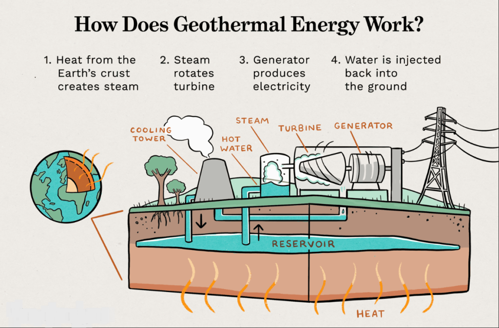

# Geothermal Energy Production and Operation 

<span style="font-size:0.6em;">Last edited: 11 Aug 2023</span> \
<span style="font-size:0.6em;">Author(s): </span>&ensp; <span style="font-size:0.6em;"> Nicolás Rangel Jurado (ETH Zürich, Switzerland - RWTH Aachen, Germany)</span> 


## Introduction and Geothermal System Types

Geothermal energy is a renewable energy resource that, in principle, can be tapped almost "anywhere" on Earth. This happens due to the universal increase in temperature with depth that occurs within Earth’s subsurface. _If you have heard people say "geothermal energy everywhere and anywhere" this is probably what they meant_. This is a unique characteristic of geothermal energy that sets it apart  from other forms of renewable energy such as wind, solar, biofuels, and hydropower, which derive their energy from sources that are found above the Earth's surface. Hence, the underground exploration and extraction of geothermal energy comes with its own set of technical and economic challenges that make it distinct from other forms of renewable energy. 

The potential of geothermal energy is enormous but making an adequate use of it requires specialized knowledge, equipment, and considerable financial investment which has slowed down and restricted its progress. To accelerate the widespread deployment of geothermal energy, numerous technical designs have been proposed over the past century to optimize the use of deep geothermal systems. These technologies vary in terms of their complexity, technological maturity, and commercial success. 

The following are the geothermal system types that are currently being actively used or studied for potential commercial use:

### Conventional hydrothermal systems

Conventional hydrothermal systems are unique in that they display what one might consider the most suitable geological characteristics to extract geothermal heat from the subsurface. This means that a conventional hydrothermal system is found when the following combination of factors coincides at depth: a high-temperature aquifer located at relatively shallow depths (less than 4 kilometers), enough pore space filled with water or brine, and a significant in situ permeability {cite}`Tester2012`. As a result of these requirements, these reservoirs are limited by geography and are usually located in areas with significant volcanic or magmatic activity. Although hydrothermal resources offer substantial energy potential, their rarity has resulted in that most high-potential resources have already been tapped. This has made discovering and developing new sites increasingly challenging or expensive.


```{figure} ../GeothermalEnergy/Production_images/CHS.png
---
align: center
---
Schematic of a conventional geothermal system (CHS) displaying a naturally permeable reservoir being recharged by rainwater. The water percolates to deepert parts of the reservoir where it heats up and it is then being produced back to the surface by geothermal wells. Taken from Rangel-Jurado et al. (2022). 
```

Given that only an arguably rare combination of geological factors give rise to hydrothermal systems, a comprehensive understanding of the geological evolution of subsurface conditions is required. As such, exploration of this type of resources usually includes various geological, geophysical and geochemical techniques. For more information regarding this, please see the [Exploration](exploration) section.

While existing conventional hydrothermal systems continue to produce vast amounts of renewable energy and, although scarce, potential new sites offer enticing opportunities, the growing demand for renewable heat and power calls for the need of alternative geothermal systems! 

### Enhanced geothermal systems

Considering that "the deeper we go, the hotter it gets", usually temperature is not the restricting variable for geothermal development. Permeability tends to be the most sought-after feature at great depths. When naturally-occurring permeability is not found, one can recurr to other ways of developing a geothermal reservoir.  Enhanced Geothermal Systems (EGS) refer to man-made reservoirs that are created by drilling wells into naturally impermeable rock formations, and then increasing their permeability through hydraulic stimulation techniques such as hydraulic fracturing (opening up new fractures in the rock) and/or hydro-shearing (displacing natural fractures in order to increase their conductivity). By stimulating the reservoir, the goal is to emulate the high productivity characteristics, meaning our ability to obtain high fluid flow rates, of hydrothermal systems. The concept of EGS was first proposed in the early 1970s by researchers at the Los Alamos National Laboratory in the United States {cite}`Armstead1987`. Since then, the technical feasibility of EGS has been demonstrated at several research sites worldwide {cite}`Breede2013, GTO2014`. However, no commercially viable EGS site currently exists that can produce heat or electricity at a competitive cost. 


```{figure} ../GeothermalEnergy/Production_images/EGS.png
---
align: center
---
Schematic of an enhanced geothermal system (EGS) displaying a deviated wellpair (one injection well, one production well) drilled into an originally impermeable rock. The wellpair is now connected at depth by a fracture network. Taken from Rangel-Jurado et al. (2022). 
```


Some of the challenges that EGS deployment must solve to overcome their techno-economic and environmental challenges are: insufficient fluid flow rate, clogging of the fracture network, preature thermal breakthrough, and induced seismicity {cite}`Breede2013, Olasolo2016, Lu2018, Kumari2019, Ge2022`. These issues have impacted the cost-competitiveness and public acceptance of EGS which has limited the successful roll-out and overall interest in EGS projects. Despite these challenges, the potential benefits of EGS, such as increased energy security and scalability, have attracted considerable interest from researchers, policymakers, and industry stakeholders. Ongoing research and commercial efforts are aimed at improving our understanding and reduce the cost of operating EGS.


### Advanced Geothermal Systems

As you can probably see by now, dealing with rocks that are buried several kilometers underground involves a great deal of uncertainty and complexity. A promising, yet controversial technology called Advanced Geothermal Systems (AGS) has emerged to extract geothermal energy while minimizing direct interaction with the rocks themselves. This is achieved by using a closed-loop system deep underground. 

In contrast to traditional hydrothermal or enhanced geothermal systems, where the fluid used to extract energy directly moves through the rock, AGS operates by circulating a fluid through a closed wellbore that is kept separate from the surrounding rock. In AGS, the geological properties of the underground reservoir are therefore less important because the working fluid does not come into direct contact with the rock. AGS technologies being currently tested propose isolating this closed-loop setup either through mechanical means (emplacing a physical barrier between the fluid and rock) or chemically (adding a substance to make the rock impermeable). Like EGS, AGS also harnesses heat from the rock through conduction. However, the thermal performance of AGS largely depends on how many closed wellbores are created (or drilled) at depth. This translates to a very significant need for drilling when implementing AGS systems, which is usually the most expensive component of developing geothermal energy.


```{figure} ../GeothermalEnergy/Production_images/AGS.png
---
align: center
---
Schematic of an advanced geothermal system (EGS) displaying a vertical wellpair connected at depth by a single lateral. This kind of configuration is also referred to as a U-loop AGS. Taken from Rangel-Jurado et al. (2022). 
```

Interestingly, the idea of extracting energy from deep closed-loop geothermal systems was first proposed almost a century ago (Hodgson, 1927), but no commercial system exists as of today. Since very little AGS field data are available yet, it is still unclear if such an underground heat exchanger that requires a great amount of drilling can sustain reasonable thermal output over multiple decades at an affordable cost {cite}`Beckers2022, Malek2022`. However,  there has been a recent increase in interest and investment in AGS technology from both industry and academia. This interest has been driven largely by a few startups in North America and Europe that are actively and exclusively working on closed-loop geothermal systems. These startups have gained a lot of traction in the public space because they claim closed-loop systems could significantly boost geothermal energy production on a larger scale while avoiding some of the problems associated with other methods like CHS and EGS, such as induced seismicity, groundwater contamination, and unpredictable interactions between fluids and rocks. For more information regarding this, please see [Issues and Safety of Geothermal Operations](issues_and_safety) section. 

Ongoing research efforts in AGS aim to improve the understanding of the commercial viability of this technology and address the technical and economic challenges that currently limit its deployment. Some of the research areas include improving the design and operation of closed-loop systems, optimizing drilling technologies, developing novel materials for subsurface heat exchangers, and assessing the environmental and social impacts of AGS projects. With continued research and development that would drive the cost of these systems down, AGS has the potential to become a key contributor to the global transition toward a low-carbon energy future.

<div class="alert alert-block alert-info">
<b>By the way:</b> Two of our researchers are looking into some of the system types discussed above! 
    Nicolás is running numerical simulations of CHS, EGS and AGS reservoirs to establish and compare their techno-economic performance over a wide range of reservoir properties and operating conditions. While Ryan is _______. Find out more <a href="https://geg.ethz.ch/nicolas-rangel-jurado/">here</a> or <a href="https://google.com">here</a>!</div>

### CO2-based geothermal systems

Traditionally, extracting geothermal energy has always involved using water or brine as the energy extraction fluid in the deep reservoir, as explained in the geothermal system types above. However, in the past two decades, scientific studies – both theoretical and numerical – have highlighted the potential of using supercritical CO<sub>2 </sub> (sCO<sub>2</sub>) instead of water. This is because sCO<sub>2</sub> has unique chemical, transport, and thermodynamic properties that make it an attractive alternative for geothermal energy extraction {cite}`Brown2000, Pruess2006, Randolph2011, Zhang2014`. As a result, for each of the three reservoir types previously discussed, a conceptual analog that utilizes sCO<sub>2</sub> as the subsurface working fluid has been proposed. In the literature, these systems are commonly referred to as CO<sub>2</sub>-Plume Geothermal (CPG) system, CO<sub>2</sub>-Enhanced Geothermal System (CO<sub>2</sub>-EGS), and CO<sub>2</sub>-Advanced Geothermal System (CO<sub>2</sub>-AGS), respectively.

Using supercritical carbon dioxide (sCO<sub>2</sub>) instead of water for extracting geothermal energy offers two key advantages:

1. **More energy production:** The excellent transport properties of CO<sub>2</sub> theoretically lead to higher energy output from geothermal reservoirs. This is because sCO<sub>2</sub> has better transport properties than water. It moves more easily due to a higher fluid mobility. The fluid mobility (i.e., the ratio between the fluid density and its dynamic viscosity) dictates how easily a fluid can flow through a matrix; and the fluid mobility of CO<sub>2</sub> is much higher than that of water, for equivalent pressure and temperature conditions. This is extremely important, both from a heat generation or electric power production perspective, because the higher the flow rate, the higher the energy production output.

   Note: A noteworthy limitation of replacing water with CO<sub>2</sub> is that the former has much better specific thermal properties than the latter. In simpler terms, if you had 1 kilogram of water and 1 kilogram of sCO<sub>2</sub>, the water would be better at moving heat around. Nonetheless, this tradeoff can easily be overcome considering that CO<sub>2</sub> allows for much larger flow rates (i.e., many more kilograms per second coming out of the production well).

2. **Reduced chemical reactivity:** CO<sub>2</sub> is not a powerful solvent for inorganic materials. This means that CO<sub>2</sub> is not expected to significantly react with and dissolve the rock-forming minerals at depth, thus avoiding issues related to mineral scaling (for more details about this, please see the [Issues and Safety of Geothermal Operations](issues_and_safety) section). Using CO<sub>2</sub> as the subsurface working fluid can therefore extend the lifespan of the wells, reduce maintenance costs, and improve the system's reliability.


```{figure} ../GeothermalEnergy/Production_images/CPG.png
---
align: center
---
Schematic of an Carbon Plume Geothermal (CPG) system displaying constan injection of CO<sub>2</sub> from a source nearby. The CO<sub>2</sub> forms an underground plume in the reservoir and it is then produced back to the surface through a production well, and injected back through the injection well after passing through the surface facilities.
```

CO<sub>2</sub>-based geothermal energy is still at a research and development stage as well. Some additional technical and environmental challenges that are being looked into include: the need for specialized materials and equipment, an overlap of a CO<sub>2</sub> source relatively close to the geothermal reservoir, the risk of CO<sub>2</sub> leakage through the subsurface, among others. Research in this field is ongoing, with the aim of getting sCO<sub>2</sub>-based geothermal systems ready for commercial use in the near future.

<div class="alert alert-block alert-info">
<b>By the way:</b> One of our researchers is looking into the chemical behavior of CO<sub>2</sub>-rich fluids in subsurface reservoirs to assess the techno-economic viability of CO<sub>2</sub>-based geothermal energy. Find out more <a href="https://geg.ethz.ch/nicolas-rangel-jurado/">here</a>!</div>

Considering the vast and largely unexplored possibilities of geothermal energy, there has been a noticeable increase in research and development endeavors in recent times. The idea of effectively and extensively implementing geothermal energy worldwide is likely to involve a mix of various geothermal facilities, consisting of the different system types explained earlier. To fully unlock the potential of geothermal energy, it is crucial for industries and academic researchers to work together collaboratively. This partnership will play a fundamental role in making sure geothermal energy reaches its full potential.


# Reservoir simulation

<span style="font-size:0.6em;">Last edited: 31 Aug 2023</span> \
<span style="font-size:0.6em;">Author(s): </span>&ensp; <span style="font-size:0.6em;"> Ryan Santoso (ETHZ - RWTH)</span> \

```{figure} ../GeothermalEnergy/Production_images/ressim_1.png
---
align: center
---
Schematic of a reservoir model used in reservoir simulations. A reservoir model is a digital copy of a physical reservoir that exists in the subsurface. Taken from https://wiki.seg.org/wiki/File:Subsurface_Modelling.png. 
```

After an initial exploration phase, a potential geothermal resource is identified. Subsequently, we assess the feasibility of implementing each geothermal system above to enable commercial heat and/or electricity production. This feasibility study is conducted primarily through reservoir simulation. 

Reservoir simulation involves computer-based calculations aimed at understanding the behavior of subsurface geothermal systems. This is achieved by solving the governing equations that pertain to mass transport, heat transport, momentum transport, and reactive transport {cite}`Kolditz2012`. Within the reservoir system, four fundamental processes come into play:

1. Thermal process (T): This process elucidates the propagation of thermal energy through conduction and advection.
2. Hydraulic process (H): Here, the movement of fluids within porous and/or fractured systems is described, following Darcy's law. 
3. Mechanical process (M): This process accounts for solid deformation brought about by changes in pore pressure, thermal stress, and tectonic influences.
4. Chemical process (C): This process involves chemical reactions between fluids and solid surfaces under specific pressure and temperature conditions.
In nature, these fundamental processes always occur at the same time, leading to coupled/multi-physics simulation condition, e.g. thermo-hydro (TH) simulations, etc.

Producing robust and reliable reservoir simulation results involves a circular process, depicted in the figure below. 

```{figure} ../GeothermalEnergy/Production_images/ressim_4.png
---
align: center
---
A simplified workflow for developing a reliable reservoir model for forecasting reservoir performance. The images within “constructing geological model” circle are taken from https://www.gempy.org/tutorials. The image within “calibrating reservoir model” circle is taken from https://vsni.co.uk/blogs/bayesian-analysis-what-is-it. The image within “developing reservoir model” circle is taken from {cite}`Santos2017`. The image within “forecasting reservoir performance” circle is taken from {cite}`Babaei2019`.
```

The steps are the following:
1.	Constructing a meshed geological model using geophysical, geological, and geochemical data as it is explained in Section "Exploration of Geothermal Resources": Geological model.
2.	Identify potential physical processes that can account for our monitoring data.
3.	Assign rocks and fluids properties according to the identified governing processes.
4.	Develop reservoir simulation by ensuring numerical stability.
5.	Perform reservoir model calibration using monitoring data.
6.	If our model's predictions fail to align with monitoring data, adjust rock and fluid property values or re-evaluate physical processes.
7.	model predictions still don't align, incorporate additional structural data and revisit Step 1.
8.	Once model predictions align with monitoring data, utilize the model for forecasting reservoir performance, such as predicting potential thermal recovery.

As it is explained in the previous Section, extracting heat from a geothermal reservoir requires a fluid circulation. In order to mimic such process in a reservoir model, we need to add producers and/or injectors. It is also to evaluate the amount of heat that can be recovered from the reservoir. The most considered injection-production patterns for geothermal reservoir development are doublet and five-spot pattern {cite}`Grant2011`. 

 ## Doublet pattern

A doublet pattern is a configuration consisting of a producer and an injector separated over a certain distance. It is the most used pattern for geothermal energy extraction. Within the simulation, cold water is injected through the injector and heated cold-water is produced through the producer. Here, we are interested in monitoring the advancement of the cold water-front. A fast arrival of cold water front at the producer will cause cooling at the producer, hence, reducing the thermal output of the system. 

 ## Five-spot pattern

Five-spot pattern is a configuration consisting of a producer with four injectors separated over a certain distance where the injectors encircle the producer. The interest is also to monitor the cold water front to avoid its fast arrival at producer. 

## Uncertainty quantification

```{figure} ../GeothermalEnergy/Production_images/ressim_2.jpeg
---
align: center
---
Schematic for performing uncertainty quantification. The image is taken from optiy.eu.
```

Since the amount of measurement data is often limited, it is critical to account uncertainties within our simulations. It is to estimate risk in any operations. The uncertainty quantification is always performed with probabilistic framework which demands numerous model runs. It is computationally expensive. An option to reduce this computational load is to use machine learning.

Machine learning provides a low-dimensional representation from parameters to any solutions or quantity of interest. However, we need to carefully use and deploy this machine learning technique since it is not interpretable and reliable {cite}`Willcox2021`.

<div class="alert alert-block alert-info">
<b>By the way:</b> One of our researchers is working on physics-based machine learning technique that includes physical laws into the machine learning construction to improve machine learning interpretability and reliability. Find out more <a href="https://easygo-itn.eu/ryan-santoso/">here</a> or <a href="https://scholar.google.co.id/citations?user=abGVFp8AAAAJ&hl=de&oi=ao">here</a>!</div></div>

```{figure} ../GeothermalEnergy/Production_images/ressim_3.png
---
align: center
---
Physics-based machine learning method for enabling robust uncertainty quantification. The image is taken from {cite}`Santoso2022`.
```

## The Heat Loss Effect in Geothermal Steam Production Well

<span style="font-size:0.6em;">Last edited: 30 Aug 2023</span> \
<span style="font-size:0.6em;">Author:</span>&ensp; <span style="font-size:0.6em;">Selvican Türkdoğan (ETHZ - RWTHA)</span>




Courtesy of [Indian Energy Portal](https://indiaenergyportal.org/geothermal-energy/)

In geothermal power generation, the efficient extraction of steam from underground reservoirs is crucial for maximizing energy production. Geothermal steam is primarily obtained through production wells drilled into high-temperature reservoirs. However, during the extraction process, a significant amount of heat is lost from the steam due to various mechanisms. Understanding and minimizing this heat loss effect is essential for optimizing the overall efficiency of geothermal power plants.

(HeatLossMechanisms)=
### Heat Loss Mechanisms:

Understanding the heat loss mechanisms is crucial for optimizing geothermal energy extraction and minimizing energy losses. The primary heat loss mechanisms in geothermal steam production wells include conduction, convection, radiation, and heat exchange with the surrounding formation. 

#### Conduction: 

Conduction is the transfer of heat through a solid medium. In the context of geothermal wells, heat loss through conduction occurs primarily through the well casing and the surrounding rock formations. The casing material, typically made of steel, has a finite thermal conductivity. As the hot geothermal steam flows through the wellbore, heat is conducted through the casing walls, resulting in heat loss to the environment. Similarly, heat can be conducted from the steam into the cooler surrounding formations, leading to a decrease in steam temperature.

#### Convection: 

Convection is the transfer of heat through the movement of fluids. In geothermal steam production wells, convection heat loss occurs when the rising steam comes into contact with cooler fluids or rock formations along the wellbore. This contact causes heat transfer from the steam to the surrounding medium, resulting in a reduction in steam temperature. Convection can also occur within the well itself, as fluid circulation patterns can lead to the mixing of hot and cooler fluids, further contributing to heat loss.


#### Radiation: 

Radiation is the transfer of heat through electromagnetic waves. In the case of geothermal steam production wells, radiation heat loss occurs as the steam interacts with the wellbore and the surrounding environment. The steam emits infrared radiation, which can escape through the wellbore and be absorbed by the surrounding formations or the atmosphere. This process leads to a loss of thermal energy from the steam, reducing its temperature.


These heat loss mechanisms have a significant impact on the overall efficiency and productivity of geothermal steam production wells. The loss of heat from the steam results in a decrease in steam temperature, which affects the efficiency of power generation. Lower-temperature steam requires additional energy input for conversion into electricity, resulting in reduced power output and decreased overall plant efficiency.[Tester, J. W., et al. (2006).](HeatLossMechanisms)

### How to mitigate the heat loss effect in geothermal steam production wells?

Mitigating the heat loss effect in geothermal steam production wells is crucial for optimizing energy efficiency and maximizing the power generation capacity. Here are several strategies and techniques that can be employed to minimize heat loss.

#### Strategies can be applied as following: 

##### *Insulation*: 

Applying insulation materials around the well casing can help reduce heat loss through conduction. Insulating materials with low thermal conductivity, such as fiberglass or ceramic fiber, can be installed to minimize heat transfer from the steam to the surrounding wellbore. Additionally, insulating the surface pipelines that transport the steam can prevent heat loss during transportation.

##### *Wellbore Integrity*: 

Ensuring the integrity of the wellbore is essential for minimizing heat loss. Proper cementing techniques and wellbore construction can help create a barrier between the steam and the surrounding formations, reducing heat transfer through conduction and convection.

##### *Downhole Heat Exchangers*: 

Implementing downhole heat exchangers can recover some of the lost heat. These devices allow for the transfer of heat from the geothermal steam to a working fluid, which can be utilized for power generation or other applications. By capturing and utilizing the heat that would otherwise be lost, the overall efficiency of the geothermal system is improved.

##### *Advanced Well Design*: 

Optimized well designs, such as double-casing systems or thermal liners, can minimize heat loss by reducing the contact between the steam and cooler surroundings. These designs create a thermal barrier that improves the retention of thermal energy in the steam and reduces heat transfer.

##### *Steam Separator and Re-injection*: 

Installing steam separators at the wellhead can help separate any non-condensable gases from the steam. These gases have a lower heat content and can be re-injected back into the reservoir, reducing the loss of valuable thermal energy.

##### *Surface Heat Recovery*: 

Implementing heat recovery systems at the surface can capture waste heat from the geothermal steam. This recovered heat can be utilized for various purposes, such as space heating, industrial processes, or district heating, further improving the overall energy efficiency of the geothermal system.

##### *Monitoring and Optimization*: 

Regular monitoring and optimization of the geothermal system can help identify and address any heat loss issues promptly. This includes monitoring well performance, steam quality, and temperature profiles to ensure efficient steam production and identify areas for improvement.

In conclusion, the heat loss effect in geothermal steam production wells poses a significant challenge to efficient power generation. It is a critical factor that influences the efficiency and productivity of geothermal power plants. Understanding the mechanisms and implementing effective mitigation strategies can help maximize energy extraction, improve power generation efficiency, and extend the lifespan of geothermal reservoirs. It is worth noting that the specific mitigation strategies employed may vary depending on the geological characteristics of the geothermal resource, the well design, and the available technologies. Therefore, it is important to consider site-specific factors and consult with geothermal experts and engineers to implement the most suitable mitigation measures for a particular geothermal steam production well.

## Well Performance in Geothermal Systems
### Well Inflow Performance

Well Inflow Performance is a critical concept in geothermal systems that helps evaluate the performance of production wells and understand the relationship between the fluid flow rate and the pressure drawdown in the reservoir. The scientist Darcy was the first studied extensively the relationship between pressure and flow rate. The IPR provides insights into the productivity of the reservoir, enabling engineers to optimize the production and maximize energy extraction.


As a function of production rate, the well's flowing bottom-hole pressure (Pwf) is referred to as the inflow performance relationship (IPR). It describes the reservoir's flow. In the pressure range between the average reservoir pressure and atmospheric pressure, the Pwf is defined. The graph that follows shows a typical link between inflow performance and inflow. 


The flow rate corresponding to a Pwf of zero is found at the point where the PI plot and x-axis connect. The Absolute Open Flow (AOF) potential of the well is represented by this location on the IPR plot.

### Vertical Lift Performance Relationship (VLP)

The bottom-hole pressure is described as a function of flow rate by the Vertical Lift Performance Relationship (VLP), also known as Outflow. Numerous variables, such as the fluid PVT characteristics, well depth, tubing size, surface pressure, water cut, and GOR, affect the VLP. It describes the flow from the wellhead to the well's bottom hole.


The wellbore flowing pressure is related to the surface production rate by both the Inflow Performance Relationship and the Vertical Lift Performance Relationship. While the IPR reflects what the reservoir can supply to the bottom hole, the VLP represents what the well can send to the surface. 


The well deliverability, which expresses what a well will actually produce for a specific operating condition (Pr, PI, WC, GOR, THP, tubing size...), is produced by the intersection of the IPR and the VLP, also known as the operational point. 
