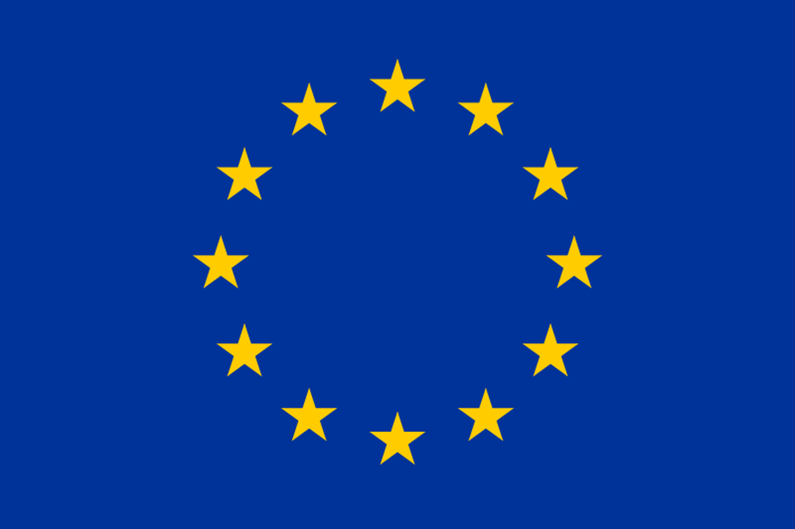
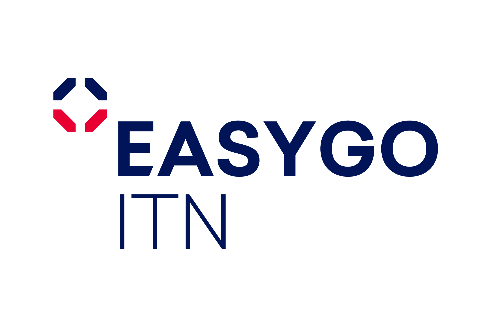
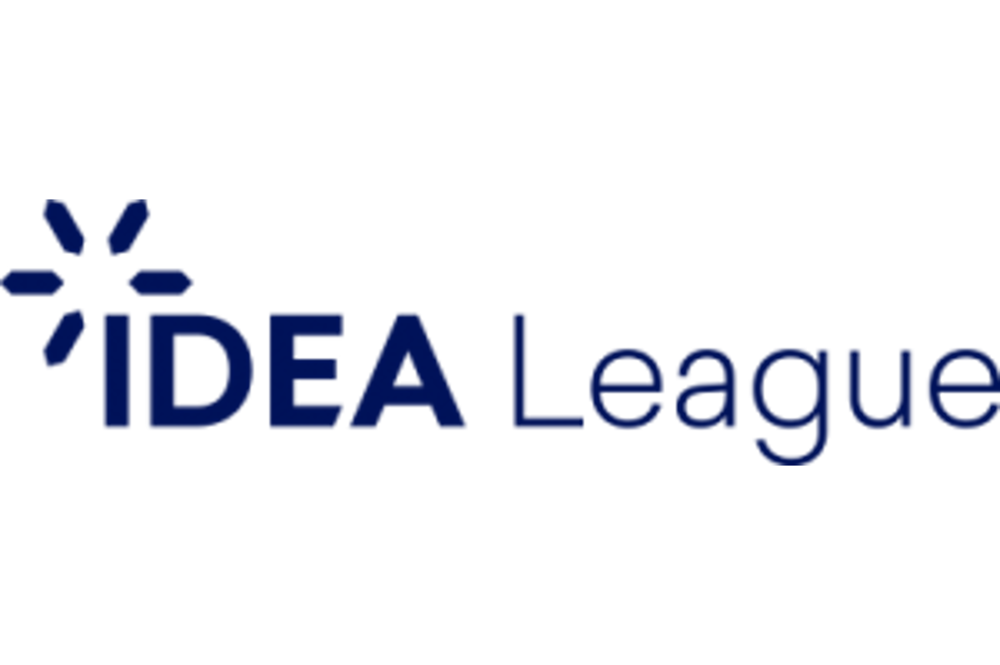

# About

As the global quest for decarbonization is underway, geothermal energy is poised to play a pivotal role in the 
renewable energy transition of many countries worldwide. To harness its full potential, there is a pressing need for 
experts with a broad and profound understanding of geothermal systems – experts who can operate these systems safely 
and efficiently.

The [EASYGO-ITN](https://easygo-itn.eu/) was created to train the next generation of geothermal experts in the 
efficient and safe operation of geothermal resources through through a multi-disciplinary approach combining geology, 
geophysics, geochemistry, advanced modelling, process engineering, and many more... 

As part of our efforts to raise awareness and a deeper understanding of geothermal energy, we have developed a wiki on 
geothermal energy. Are you a high school or undergraduate student or just want to learn more about geothermal energy? 
Here, you can learn more about one of Earth's most promising, potent, and sustainable energy sources! Join us as we 
embark on this transformative journey!

```{tableofcontents}
```

# License
This work has been created under a [GNU General Public License v3.0](https://www.gnu.org/licenses/gpl-3.0.en.html).

# Citation
We suggest the following citation:
* EASYGO-ITN, Kottsova, A., Luo, W., Naranjo, D., Eltayieb, M., Galieti, L. Söding, H., Rangel Jurado, N., Türkdoğan, S., Ouf, J., Santoso, R., Balza Morales, A.E., Gómez Diaz, E., Merbecks, T. (2024). *Geothermal energy - an introduction to the topic and key issues*. [https://easygo-itn.github.io/Deliverable_4_2/](https://easygo-itn.github.io/Deliverable_4_2/)


# Acknowledgements

The EASYGO project [https://easygo-itn.eu/](https://easygo-itn.eu/) has received funding from the European Union's Horizon 2020 Research and 
Innovation Programme under the Marie Skłodowska-Curie Grant Agreement No 956965.


| Our collaboration partners` `                                  | `                  `                    | `                  `                         |
|----------------------------------------------------------------|--------------------------------------------------|---------------------------------------------------------|
|  |  |  |

# Disclaimer

The content of this wiki reflects only the authors’ views. The Research Executive Agency (REA) is not responsible for 
any use that may be made of the information it contains. 


